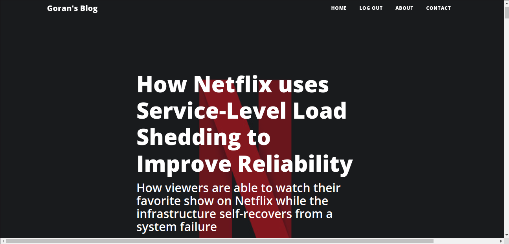
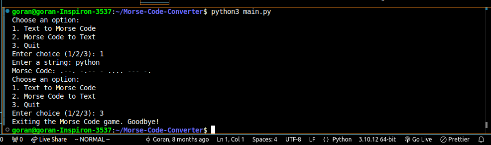
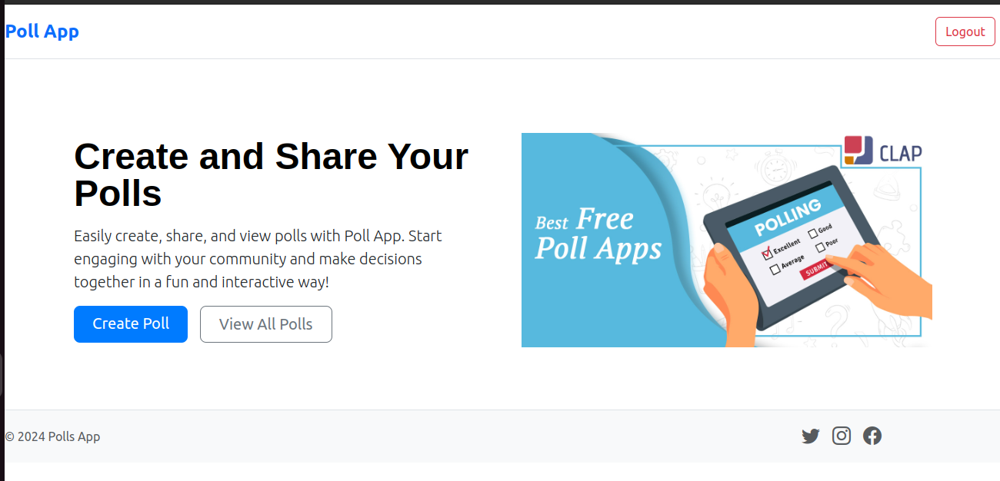
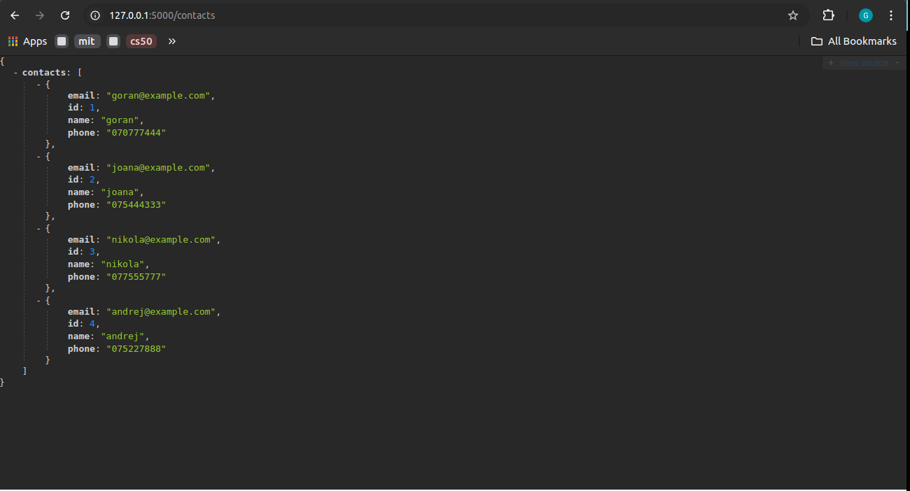
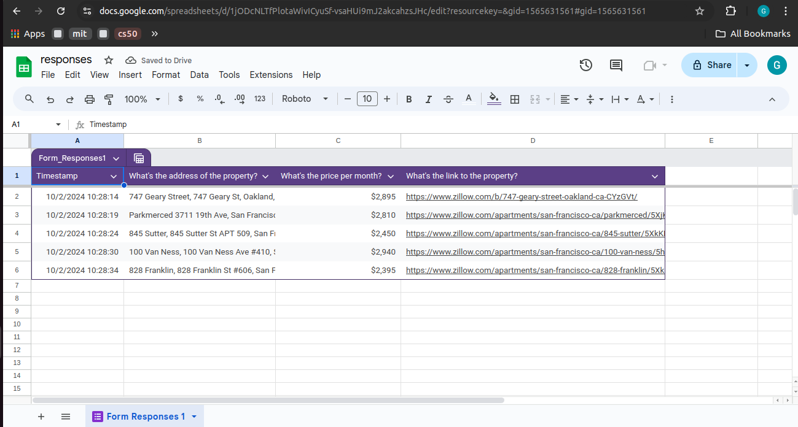

# 🌟 Goran Ivanovski's Portfolio 🌟

Portfolio Project is a website created with Flask framework, Bootstrap 5, CSS, HTML, and JavaScript. Its purpose is to act as a source of information about my professional life and to allow visitors to check out my projects through attached hyperlinks.

## 🛠️ Skills

Here’s a glimpse of the tools in my toolbox:

-   **Python**: 90% 🐍
-   **Flask**: 90% ⚙️
-   **SQL**: 90% 📊
-   **HTML**: 85% 🌐
-   **CSS**: 85% 🎨
-   **JavaScript**: 75% 📜
-   **Bootstrap 5**: 85% 🏗️
-   **Selenium & Beautiful Soup**: 80% 🔍
-   **C**: 80% ⌨️
-   **SQLAlchemy**: 80% 🗄️

## 💼 My Projects

Here’s a showcase of my favorite projects, each representing a stepping stone in my learning journey:

1. **[Flask Blog](https://late-rosmunda-goran-ivanovski-29cf461d.koyeb.app/)**  
   A dynamic web application built with Flask, designed for creating and managing blog posts with user interactions. Dive into the experience and try out the app yourself! 🌐  
     
   [GitHub Repository](https://github.com/Givanovski/blog-for-deployment)

2. **[Morse Code Converter](https://github.com/Givanovski/Morse-Code-Converter)**  
   A fun little tool that translates text to Morse code and back, perfect for sending secret messages!  
   

3. **[Poll App](https://poll-app-uubz.onrender.com/)**  
   Join the voting revolution! This app allows users to create, share, and vote on polls with real-time results.  
     
   [GitHub Repository](https://github.com/Givanovski/poll-app)

4. **[Contact Manager API](https://github.com/Givanovski/Contact-Manager-Application)**  
   A RESTful API for managing your contacts, featuring all the CRUD operations you need! [API Documentation](https://web.postman.co/workspace/18f135b2-b1f2-4ec1-80f7-d849108b608d/documentation/32546891-32cfce4f-7cec-4d38-a990-09918e8780e2)
   

5. **[Rental Property Scraper](https://github.com/Givanovski/Rental-Property-Scraper)**  
   An efficient script that scours the web for rental property listings, making the search for a new home a breeze!
   

## 📬 Let's Connect!

I’m always eager to network and collaborate! Feel free to reach out:

-   **Email**: [goranivanovski1611@gmail.com](mailto:goranivanovski1611@gmail.com) 📧

## Future Development

I plan to further develop this website by adding more content, showcasing programming or Data Science examples, improving the design and user experience, and incorporating additional features to make it more engaging and useful to visitors.
